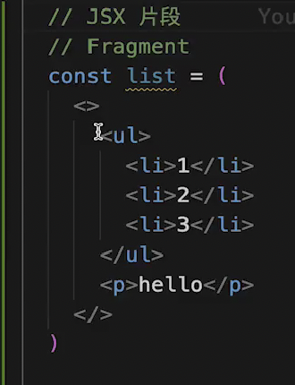

# JSX 语法

JSX - JS 语法扩展，可以在 JS 中写模板（类似 HTML 语法）<br>
JSX 已经成为 ES 语法标准，也可用于其他框架，如 Vue3

- 标签
- 属性
- 事件
- JS 表达式
- 判断
- 循环

# 标签
1. 首字母大写
2. 每段jsx中只能有一个单根节点， 可以使用片段  <></>

3. 闭合标签
4. 标签必须闭合

function App () {
  return (
    </>
      ....
    </>
  )
}

# 属性
** 1. 和HTML属性基本一样，但有些和JS关键字冲突了 **

- `class` 要改为 `className`
- `style` 要写成 JS 对象（不能是 string），key 采用**驼峰写法**
- `for` 要改为 `htmlFor`
 
```jsx
function App () {
  return (
    <div className="app" style={{color: 'red', backgroundColor: 'blue'}}>
      <input id="input" />
      <label htmlFor="input">hello world</label>
    </div>
  )
}
```
